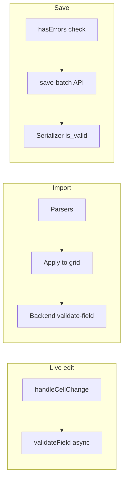
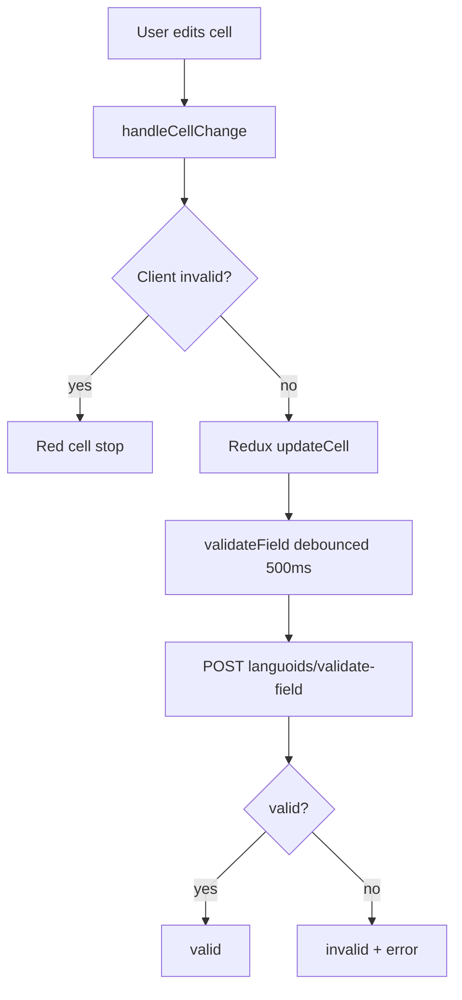
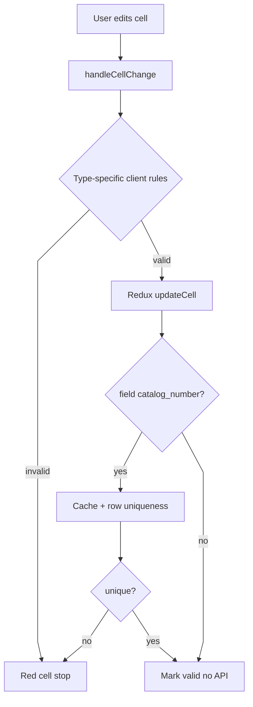
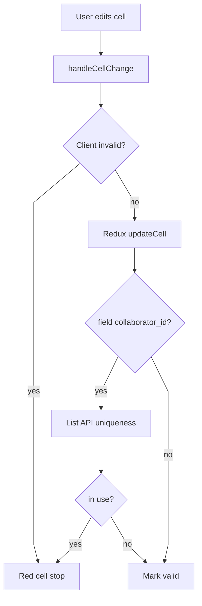
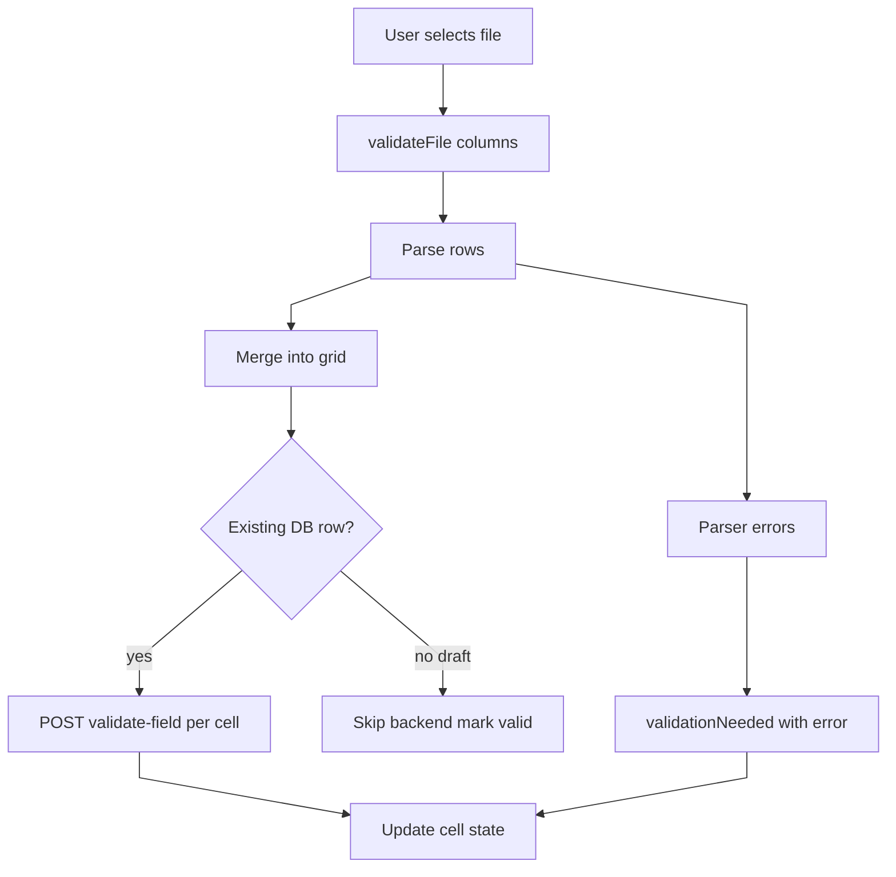
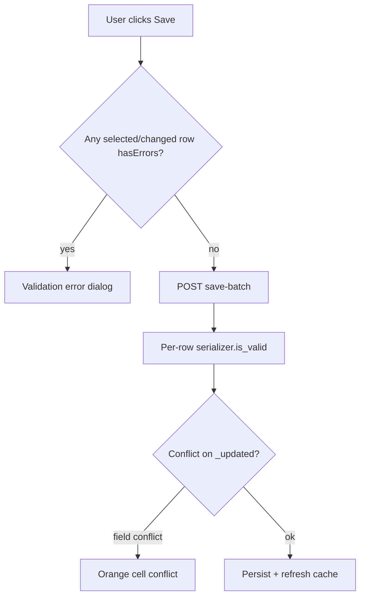

# Batch Editor Validation

**Last verified:** 2026-05-25 (intentional-design reframe; code unchanged since 2026-05-24)

**Audience:** Developers maintaining or extending batch editors

**Canonical doc:** This file is the source of truth for validation flows. Older notes in [editing-features.md](editing-features.md) defer here.

---

## Diagram authoring (for humans and LLM updates)

Keep Mermaid diagrams readable in GitHub and IDE previews:

| Rule | Target |
|------|--------|
| Max nodes per diagram | ~12 |
| Max decision diamonds | ~2 |
| Default direction | `flowchart TD` (processes), `LR` (pipelines) |
| Edge style | `%%{init: {'flowchart': {'curve': 'linear'}}}%%` at top of each block |
| Scope | One concern per diagram (live edit, import, or save — not all three in one graph) |
| Cross-links | Avoid; split into a second diagram instead |

When updating via chat, specify the section anchor (e.g. "Item live edit") so only that diagram changes.

**Preview:** Render in GitHub or your Markdown viewer before treating layout as final. Chat preview may differ slightly.

---

## Shared model (all batch editors)

Every batch editor stores validation on each cell:

| Property | Meaning |
|----------|---------|
| `validationState` | `valid` \| `invalid` \| `validating` |
| `validationError` | Tooltip / dialog message when invalid |
| `row.hasErrors` | `true` if any cell on the row is `invalid` |

Visual styling: `MemoizedSpreadsheetCell.tsx` (red = invalid, yellow = edited, orange = conflict).

Three validation **layers** (same idea, different implementation per model):



---

## Editor comparison

| Aspect | Languoid | Collaborator | Item |
|--------|----------|--------------|------|
| Live backend `validate-field` | Yes (debounced 500ms via `useFieldValidation`) | No — only `collaborator_id` checked via list API | No — only `catalog_number` (client + cache) |
| Live client rules | Yes (`handleCellChange`) | Yes | Yes (extensive: titles, collaborators, M2M, etc.) |
| Import backend `validate-field` | Yes (all changed cells) | Yes (except skipped fields) | Yes (existing rows; skips virtual fields) |
| Import skip backend | None | `native_languages`, `other_languages` | `primary_title`, `secondary_title`, `collaborators`, `language` |
| New draft rows on import | Backend validation runs | Backend validation runs | Backend skipped (marked valid) |
| Save gate (`hasErrors`) | Yes | Yes | Yes |
| Final authority | `save-batch` + `Internal*Serializer` | Same | Same |
| Custom cell editors | Standard `CellEditor` | Standard | `CollaboratorRolesCellEditor`, `TitleWithLanguageCellEditor` |

---

## Intentional design (tiered validation)

Live edit, import, and save use **different validation strategies on purpose** — not a bug to “unify” Item with Languoid live-backend calls.

| Tier | Goal | Why not one path everywhere |
|------|------|------------------------------|
| **Live edit** | Instant feedback while typing | Per-keystroke `validate-field` on 4,400+ Item rows is costly (`performance.md`: hundreds of cells on paste already ~2–3s). Composite/virtual fields cannot use `validate-field` anyway. |
| **Import** | Correct parsed spreadsheet values before commit | Batch operation; spinner acceptable; backend validates real model fields after parsers run. |
| **Save** | Authoritative persist | `save-batch` + full serializer is the source of truth regardless of live path. |

**Item/Collaborator (Nov 2025):** Shipped with client-heavy `handleCellChange` and deferred live `validate-field` (`// For now, mark all other fields as valid` in `ItemBatchEditor.tsx`). Matches scale, custom editors, and virtual-field patterns documented in `item-batch-editor.md`.

**Languoid (~1,200 rows, simpler fields):** Client fast-reject plus debounced live `validate-field` — appropriate at smaller scale.

**Do not assume:** “Item should call `validate-field` on every live edit like Languoid” without a performance and UX goal (e.g. batch validate API in `performance.md` future work).

---

## Live edit

### Languoid (reference: backend-debounced)



**Key files:** `LanguoidBatchEditor.tsx`, `useFieldValidation.ts`, `validationAPI.ts` (`validateLanguoidField`)

---

### Item

Client does most work; async `validateField` only enforces **catalog number** uniqueness (spreadsheet + Redis cache). Other fields are marked `valid` without calling the API.



**Client rules in `handleCellChange` (non-exhaustive):**

- Required columns on draft rows with changes
- `primary_title` / `secondary_title`: structured objects only; no plain-text paste
- `collaborators`: array shape; no `id: null`; valid roles and `citation_author`
- `language`: M2M array; no `id: null`
- `multiselect` / `select` / `boolean` / `decimal`: format and choice lists

**Design note:** Extensive client rules exist because titles, collaborators, and languages are structured/composite — not because backend validation was forgotten. `catalog_number` uses cache + spreadsheet checks because uniqueness must be immediate without waiting for debounced API.

**Key files:** `ItemBatchEditor.tsx` (`handleCellChange`, `validateField`)

---

### Collaborator

Similar to Item: client-first. `collaborator_id` uniqueness uses **list API** lookup, not `validate-field`. Comment in code: other fields marked valid without backend live validation.



**Key files:** `CollaboratorBatchEditor.tsx`

---

## Import

Shared pipeline; per-model hooks and skip lists differ.



| Model | Hook | Transformer / mapper |
|-------|------|----------------------|
| Languoid | `useImportSpreadsheet.ts` | Languoid import services |
| Collaborator | `useImportCollaboratorSpreadsheet.ts` | `collaboratorImportTransformer.ts` |
| Item | `useImportItemSpreadsheet.ts` | `itemImportTransformer.ts`, `itemImportValueParsers.ts` |

**Invalid data preservation (Item):** Parsers return `id: null` for unknown collaborators/languoids; cells stay red until user fixes in custom editor. See `parseCollaboratorsWithRoles`, `parseCommaSeparatedLanguoids` in `itemImportValueParsers.ts`.

**Backend `validate_field` (all models):**

- Endpoint: `POST /internal/v1/{items|collaborators|languoids}/validate-field/`
- Runs serializer field `run_validation`, then `validate_<field>` if present
- **Important:** Pass deserialized value to custom validators (e.g. `Decimal` for lat/lng) — fixed 2026-03-14 in `InternalItemViewSet.validate_field`

---

## Save

Same gate for all models.



- **Client:** Blocks save when `validationState === 'invalid'` on edited rows
- **Backend:** `save_batch` in `app/internal_api/views.py` — full create/update validation, optimistic locking via `_updated` and `_original_values`
- Virtual/composite Item fields (titles, collaborators) are applied in serializer `create`/`update`, not via `validate-field`

---

## Backend API reference

### `validate-field`

```http
POST /internal/v1/items/validate-field/
Content-Type: application/json

{
  "field_name": "latitude",
  "value": "35.5",
  "row_id": 42,
  "original_value": "35.0"
}
```

Response: `{ "valid": true }` or `{ "valid": false, "error": "..." }`

Item-specific: `catalog_number` also checks DB uniqueness (excluding current `row_id`).

### `save-batch`

Bulk save with field-level conflict detection. Errors return per-row; non-conflicting fields may still save when conflicts are partial.

---

## Visual states (quick reference)

| UI | State | Meaning |
|----|-------|---------|
| Red border/background | `invalid` | Failed client and/or backend validation |
| Yellow background | `isEdited` | Changed from loaded value; may still be valid |
| Orange | `hasConflict` | Another user changed DB since load (not the same as invalid) |
| Spinner / `validating` | Import or debounced Languoid check in progress |

Hover red cells for `validationError` text (`aria-invalid` set for accessibility).

---

## Optional enhancements (not required for correctness)

These improve UX or parity with Django validators; **save-batch already rejects invalid data** if client rules miss an edge case.

| Enhancement | Example | Notes |
|-------------|---------|-------|
| Client mirrors Django-only rules | Lat/lng range (-90..90, -180..180) | Client checks format today; `validate_latitude` also checks range on import/save |
| Map `save-batch` errors to cells | Serializer failure on one field | Today often a generic toolbar error, not red cell |
| Batch `validate-field` API | Many cells, one request | Listed in `performance.md` as future optimization |
| Stale code comment | Collaborator `validateField` | Says “no backend validation endpoint yet”; endpoint exists — import uses it |

---

## Maintenance checklist

When changing validation behavior, update in the same PR:

| Code change | Update in this doc |
|-------------|-------------------|
| `ItemBatchEditor` `handleCellChange` / `validateField` | [Item live edit](#item-live-edit) |
| `useImportItemSpreadsheet` skip list | [Editor comparison](#editor-comparison), [Import](#import) |
| `InternalItemViewSet.validate_field` | [Backend API reference](#backend-api-reference) |
| New cell type in `CellEditor` | [Shared model](#shared-model) + model section if special rules |
| `save_batch` conflict logic | [Save](#save) |

Also update **Last verified** date at top when you confirm behavior against code.

---

## Related documentation

- [Editing features](editing-features.md) — undo/redo, copy/paste (validation summary only)
- [Cell types](cell-types.md) — editor types per column
- [Architecture](architecture.md) — component hierarchy
- [Item batch lessons](../../../context/03-LESSONS/item-batch-editor.md) — implementation patterns and anti-patterns
- [Batch editor patterns](../../../context/02-PATTERNS/batch-editors.md) — universal batch patterns
